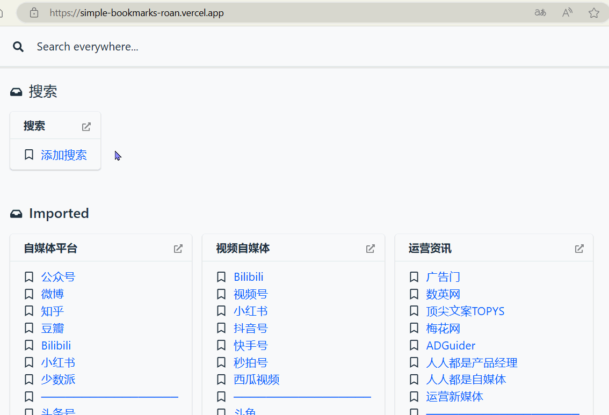
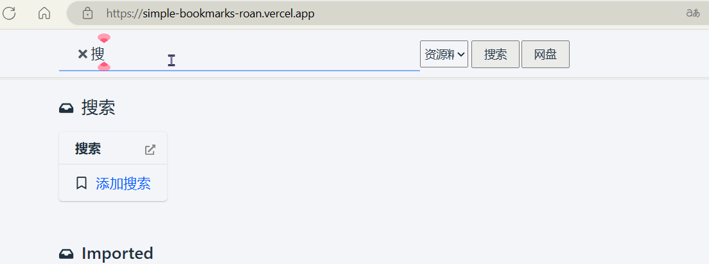

 

# 简约静态书签

> 为了方便自己，加工的一个静态书签，直接托管在vercel等静态网站托管上，也可以托管在github page上。

直接看预览效果：

# 项目效果

## 预览效果

Demo：https://simple-bookmarks-roan.vercel.app/


<details>

  <summary>搜索预览</summary>

  

</details>

<details>

  <summary>添加网盘搜索按钮并搜索</summary>

  搜索时，会使用所有网盘引擎在新标签页搜索
  

</details>

<details>

  <summary>使用搜索引擎搜索</summary>

  

</details>

## 效果说明

1. 直接输入关键字能展示相关书签；
2. 点击“添加搜索引擎书签”后，会调用外部js，在页面中添加按钮与选择列表，用于搜索引擎与网盘搜索引擎的调用；
   1. 搜索引擎：选择合适的google、网盘资源等搜索引擎，点击`搜索`按钮后，会打开一个新的标签页进行搜索
   2. 网盘搜索引擎：直接点击网盘搜索按钮，会<u>使用所有网盘搜索引擎在新标签页中建立搜索</u>


# 操作步骤

所引用的项目地址：[darekkay/static-marks: Shareable bookmarks (github.com)](https://github.com/darekkay/static-marks)

安装前需要npm环境，如果没有，请参考项目中的readme文档


1. 安装该工具

   ```
   npm install -g static-marks
   ```

1. 导出的书签文件，使用该工具将其转换成yml格式

   ```
   static-marks import 书签文件.html > bookmarks.yml
   ```

1. 然后再将我的搜索引擎也添加进去：使用的时候，点击这个书签，就会添加搜索按钮。

   该js路径根据你实际的来，默认在js/pan.js中，看你如何编写或者放在哪儿。

   ```
   - 添加引擎: javascript:const script23=document.createElement('script');script23.src="./js/pan.js";script23.onload=function(){console.log('Script loaded and executed.')};script23.onerror=function(){console.error('Error loading the script.')};document.head.appendChild(script23);
   ```

2. 将yml其转换成html

   ```
   static-marks build bookmarks.yml > index.html
   ```


最后再进行部署在vercel上即可：因为这是纯静态文件，所以直接部署就行，不需要其他环境。

进阶：可以使用github action工作流来完成上面的部分命令，由于我暂时没有相关需要，所以暂无需求。